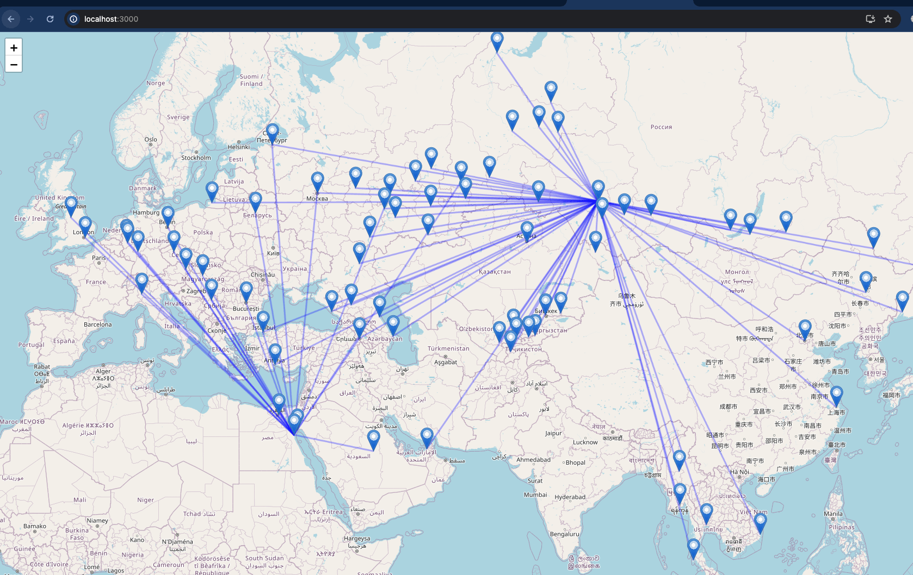
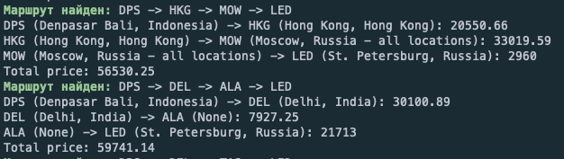

## Draft: flight search engine

Backend works on Python 3.10.12 for sure.

Use `pip install -r requirements.txt` to install all required packages.

`python app.py` to run the backend.

Frontend works on NodeJS 16.13.1 for sure.

`yarn` to install frontend dependencies.

`yarn start` to run the frontend.

Then go to http://localhost:3000 in your browser.

### See [TODO.md](TODO.md) for what to do.