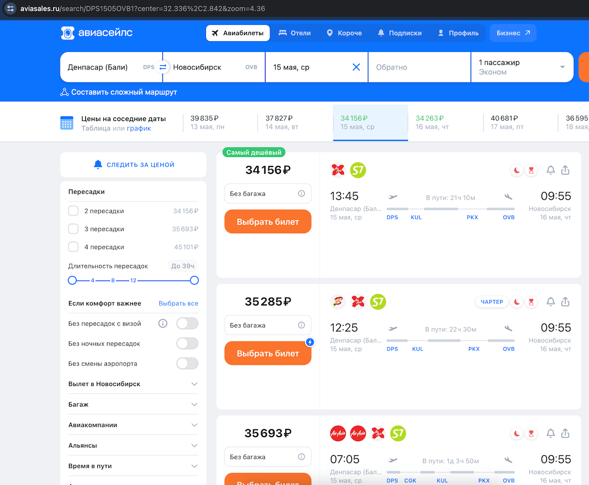
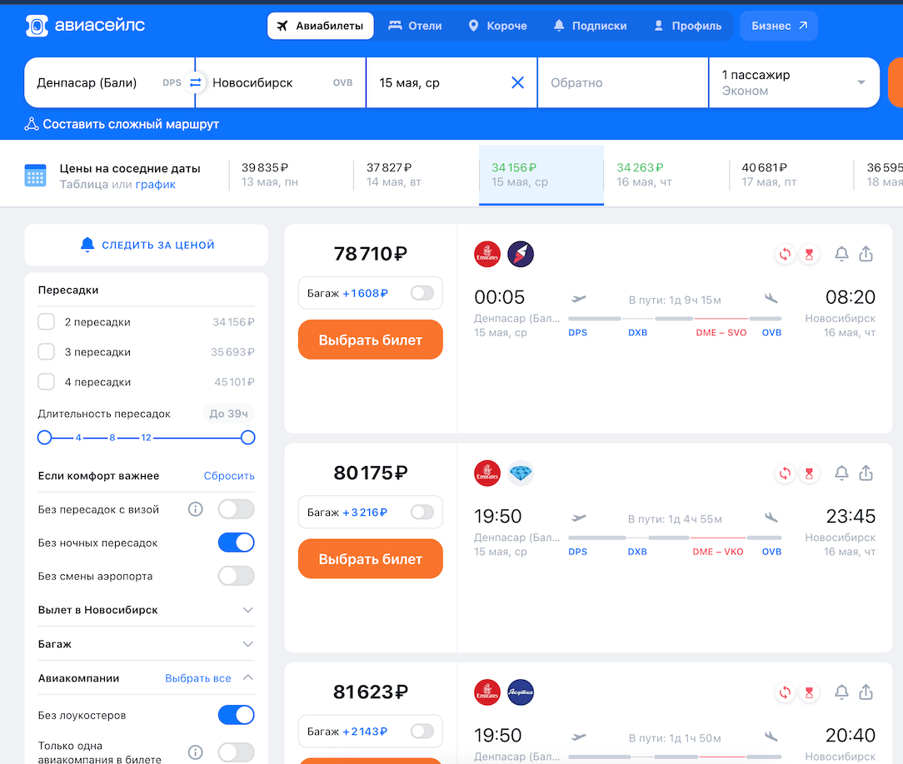

### Актуальность проекта:

_(реальная драматическая история в деталях)_

Например, при поиске билетов с Бали в Новосибирск, в зависимости от месяца и везения может сложиться впечатление, 
что это обойдется в 100 тысяч рублей и/или вас будут ждать какие-то неудобные ночные пересадки, а то и парочка:

(С ценой повезло в этот раз, ровно год назад была реальная ситуация с рейсами за сотку)

Но, например, я не хочу проводить сутки в полете, не хочу ночную пересадку, не хочу лететь через Китай,
особенно с повторной регистрацией на рейс там. Потому что у меня полный чемодан электроники и китайцы как минимум ее 
всю перетряхнут (и заодно - весь мозг невыспавшемуся мне), а если не повезет - что-то заберут.

И я готов доплатить за свои хотелки, но желательно не до 100К, конечно.

Если попробовать существующими фильтрами убрать ночные пересадки и лоукостеры (привет кошмарной Победе), 
то станет дороже, но все так же неудобные пересадки и плюс - я теперь наматываю лишние крюки по планете 
через Дубай и Москву:

Плюю на это дело, открываю свою карту (до ее создания - открывал [карту](https://aviasales.ru/map) Авиасейлс напрямую), 
тыкаю в аэропорт Бали/Денпассар, смотрю куда оттуда есть прямые рейсы. 
Внезапно вижу рейс в Ташкент! Пытаюсь его найти, понимаю что это какой-то баг, ну да ладно - бывает.

Но это меня наводит на мысль, что я никогда не был в Узбекистане, а там очень вкусная еда, мясо, овощи и черешня!
И недорого! И, кажется, он где-то недалеко от Новосибирска.🤔

Тыкаю в Джакарту - столицу Индонезии, час лету от Бали и очень дешево - из Джакарты тоже показывает рейс в Ташкент, 
проверяю - действительно есть прямой рейс по средам и субботам.

Тыкаю в Новосибирск (или в Ташкент) и вижу что там тоже есть прямые кроме среды и пятницы.

Ну и прекрасно, до Джакарты я как-то доберусь, там сяду на второй рейс, в Ташкенте пару ночей посплю, 
погуляю, облопаюсь черешни и полечу дальше! Проверяем билеты:

Бали -> Джакарта:

Джакарта -> Ташкент:

Ташкент -> Новосибирск

Вуаля - мы прекрасны! История реальная - в Ташкенте я облопался офигенного шашлыка из баранины, отдохнул от балийской жары, 
поработал пару дней из отеля, наелся безумно вкусной черешни и еще и домой в Новосиб ее привез целых 3 кг:)