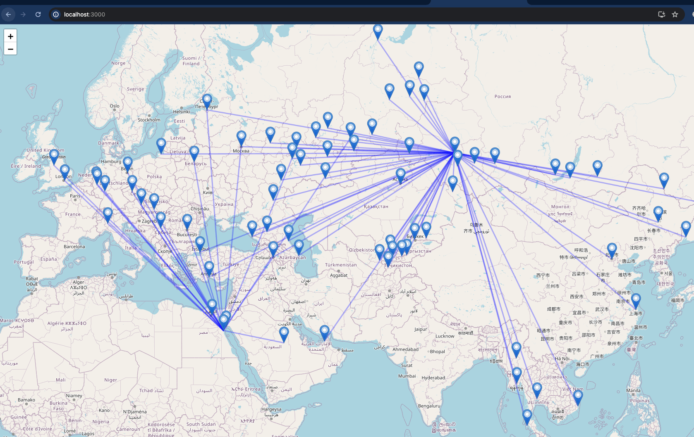

Всевозможные доделки и тудушки.

## Technical:

Use the SCV file from this repo https://github.com/ip2location/ip2location-iata-icao
for the Airport names, IATA codes and coordinates. Turn it into a JSON file.

And then all logic related to `airport_coordinates.json` can be removed.

## User Interface:

Приложение сейчас реализует две контуженные и недоделанные юзер-стори:

### Первая:
Веб-приложение позволяет визуализировать граф прямых рейсов между аэропортами. 
Но при этом не позволяет выбрать кастомные аэропорты, сейчас начальные точки захардкожены в 
`const MyMap` в `Map.js`. Практической пользы пока не несет, но можно прикольно 
посмотреть откуда куда можно улететь без пересадок.



- Тут было бы здорово реализовать интерфейс типа как на Авиасейлс или любом другом поисковике билетов - 
чтобы был дропдаун с автодополнением ко вводу пользователя.
- И показывать цены по наведению на линии, например.
- И название города при наведении на пин.

### Вторая:

Через консоль можно найти оптимальный маршрут:

```bash
python scripts/find_best_route.py DPS OVB [--max-price=70000] [--max-flights=2]
```

Т.е. например в два перелета максимум можно добраться с Бали в Питер за 62К рублей:

```bash
❯ python scripts/find_best_route.py DPS LED --max-flights=2 [--max-price=70000]                                                                                                                                                                          flights 3.10.12 21:32:54
Маршрут найден: DPS -> SHA -> LED
DPS (Denpasar Bali, Indonesia) -> SHA (None): 20348.7
SHA (None) -> LED (St. Petersburg, Russia): 44924.01
Total price: 65272.71000000001

Маршрут найден: DPS -> AUH -> LED
DPS (Denpasar Bali, Indonesia) -> AUH (Abu Dhabi, United Arab Emirates): 44622.45
AUH (Abu Dhabi, United Arab Emirates) -> LED (St. Petersburg, Russia): 18240.43
Total price: 62862.88
```

А если пользователю окей три перелета, лишь бы меньше платить, то можно и в 45К уложиться:

```bash
❯ python scripts/find_best_route.py DPS LED --max-flights=2 [--max-price=70000]
Маршрут найден: DPS -> KUL -> BJS -> LED
DPS (Denpasar Bali, Indonesia) -> KUL (Kuala Lumpur, Malaysia): 6333.39
KUL (Kuala Lumpur, Malaysia) -> BJS (None): 9597.24
BJS (None) -> LED (St. Petersburg, Russia): 28955.96
Total price: 44886.59

Маршрут найден: DPS -> KUL -> ALA -> LED
DPS (Denpasar Bali, Indonesia) -> KUL (Kuala Lumpur, Malaysia): 6333.39
KUL (Kuala Lumpur, Malaysia) -> ALA (None): 17517.5
ALA (None) -> LED (St. Petersburg, Russia): 21713
Total price: 45563.89
```

Вот для этой юзер-стори было бы здорово реализовать какой-то веб-интерфейс!

Опять же: 
- выпадашки с выбором начальной и конечной точки
- выпадашка с максимальным количеством пересадок и ценой
  - какие-то дефолтные значения для них, 
  2 и 70К например соответственно
  - разумные максимальные значения которые бекенд в принципе будет принимать - чтобы нельзя было отправить запрос с 20 максимальными пересадками чтобы он сто лет обрабатывался 
- собственно АПИ для общения с бекендом
- а дальше уже в меру фантазии - придумать как получать запросы с бекенда, если поиск занимает длительное время